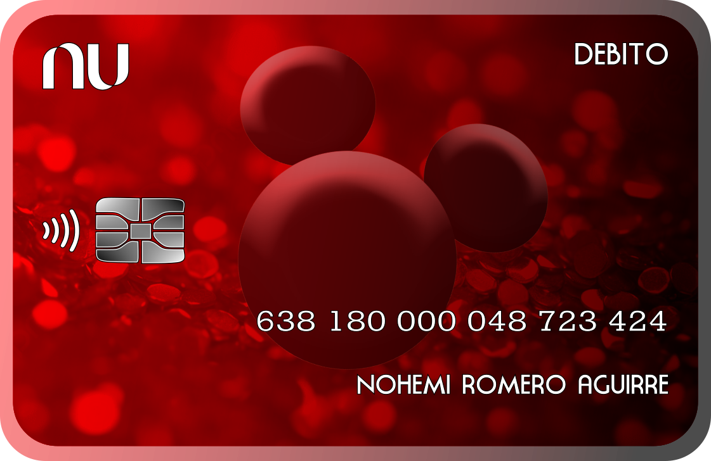

## 📄 **README.md**

```markdown
1 💳 Tarjeta Débito Digital

Tarjeta de débito digital interactiva para compartir el número de cuenta fácilmente.



2 🚀 Características

- 📋 Copiar número de cuenta con un clic
- 📱 100% responsive (móvil y escritorio)
- 🔗 Compartir por WhatsApp
- ✨ Animaciones suaves
- 🎨 Diseño elegante

3 📁 Archivos
📂 tarjeta-digital/
├── index.html    # Estructura
├── styles.css    # Estilos
├── script.js     # Funcionalidad
└── Mickey.png    # Imagen

4 🛠️ Cómo usar

1. Abre `index.html` en tu navegador
2. Haz clic en "Copiar número de cuenta"
3. Comparte el enlace por WhatsApp

5 📝 Personalizar

1. Cambiar número de cuenta
Edita `script.js` línea 9:
```javascript
const ACCOUNT_NUMBER = '638 180 000 048 723 424';

2. Cambiar WhatsApp
Edita `index.html`:
```html
<a href="https://wa.me/525531178903">
    +52 55 3117 8903
</a>```

6 🌐 Ver en vivo

https://josephantoninos.github.io/Nohemi-Tarjeta-Digital/

---

👤 Creador

**Joseph Antoninos**

📱 WhatsApp: +52 55 3117 8903
💼 GitHub

📄 Licencia

Este proyecto es de uso libre. Puedes modificarlo y adaptarlo a tus necesidades.
